# React Native Image App

EN - This project is the sixth assignment within the scope of "Akbank React Native Bootcamp" organized by Patika.dev. It includes the sign in and sign up screen, home screen, map screen and settings screens.

TR - Bu proje Patika.dev 'in düzenlediği "Akbank React Native Bootcamp" kapsamında yapılan altıncı ödevdir. Image App uygulamasında giriş ve kayıt ekranı, ana ekran, map ekranı ve ayarlar ekranı bulunmaktadır.
<br/><br/>

## Technologies


<br/>

## Packages

- Expo
- Expo Map
- Expo Location
- Expo Image Picker
- Firebase
- Axios
- React Navigation
- Async Storage
- ReduxJS Toolkit
- React Hook Form

<br/>

## Features

- Sign in Screen
- Sign up Screen
- Home Screen
- Map Screen
- Theme Setting Screen
- Profile Setting Screen
- Supports dark/light mode 🌗

<br/>

## Todo

- Different marker for each user
- More image details
- New additional features to the settings page

<br/>

## Installation

```
yarn install
yarn start
```

<br/>

## Screens

### Gif

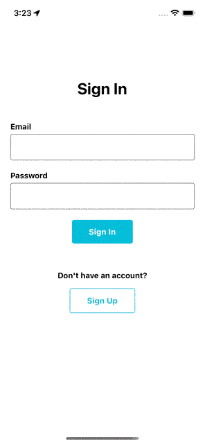

### ScreenShot Light / Dark Theme

<table>
    <tbody>
        <tr>
            <td>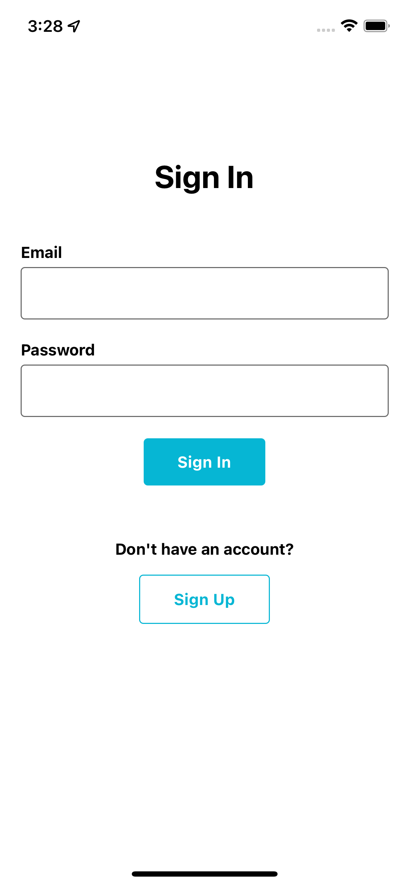</td>
            <td>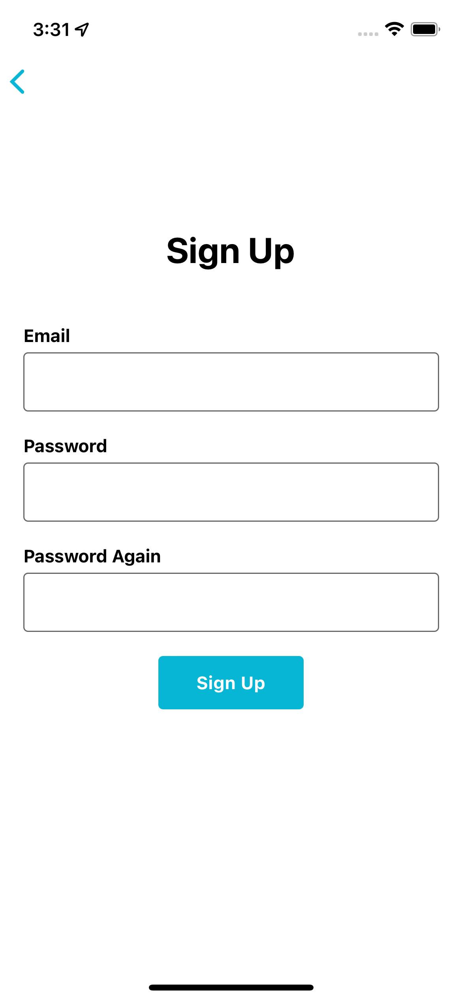</td>
        </tr>
        <tr>
            <td>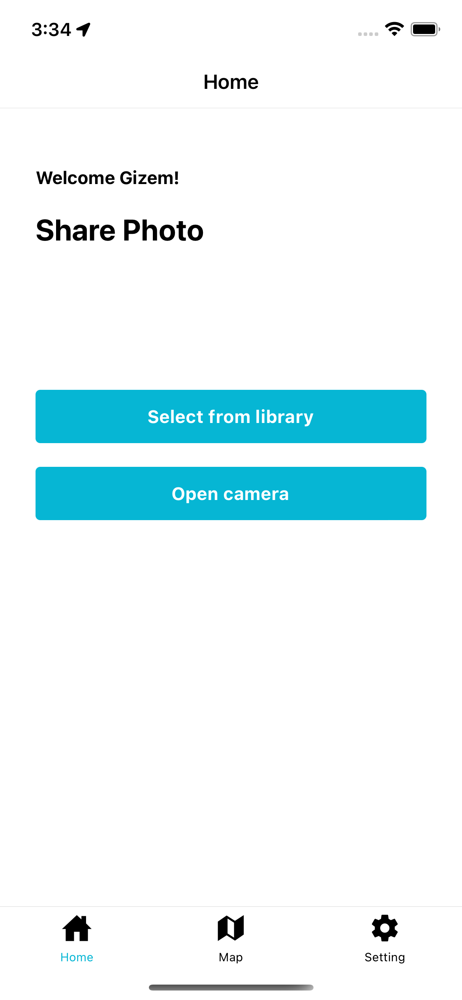</td>
            <td>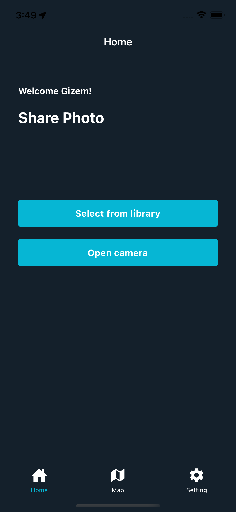</td>
        </tr>
        <tr>
            <td>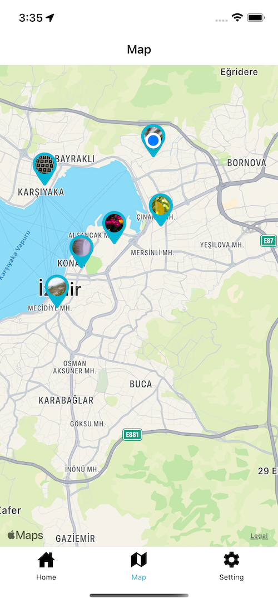</td>
            <td>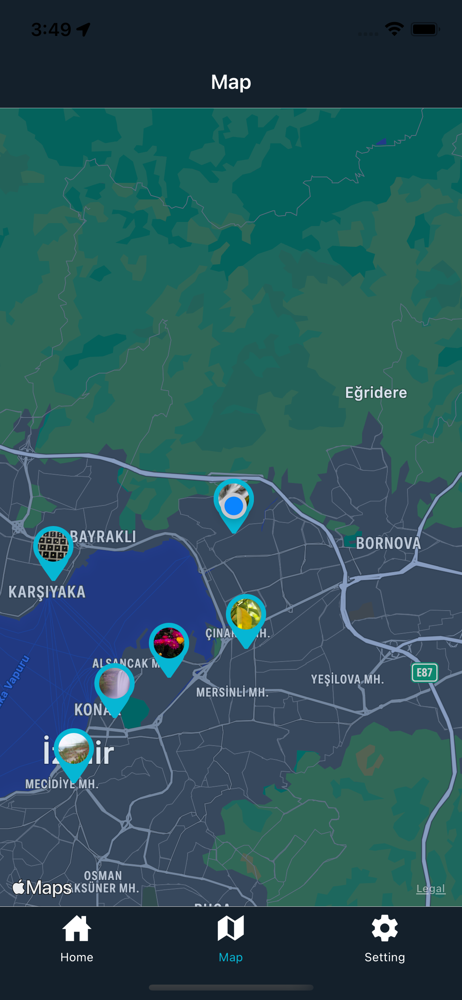</td>
        </tr>
        <tr>
            <td>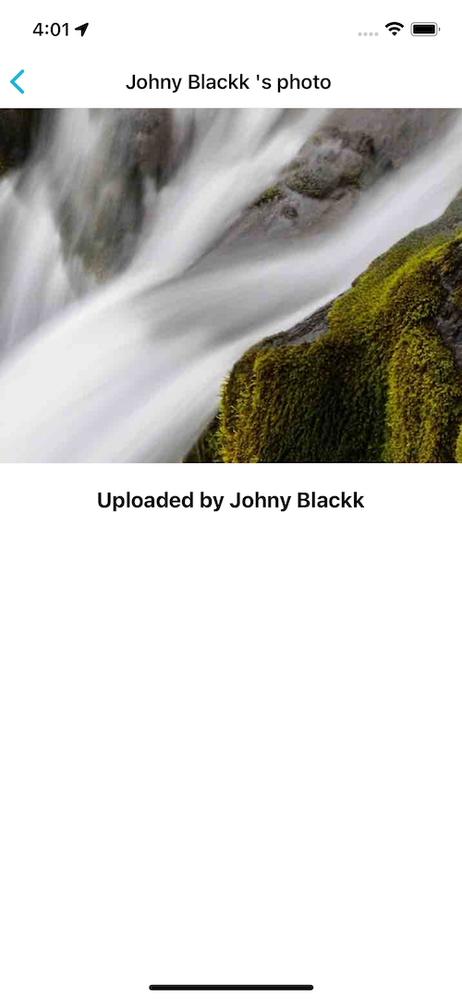</td>
            <td></td>
        </tr>
        <tr>
            <td>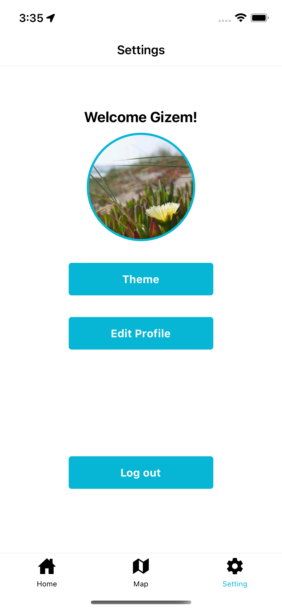</td>
            <td>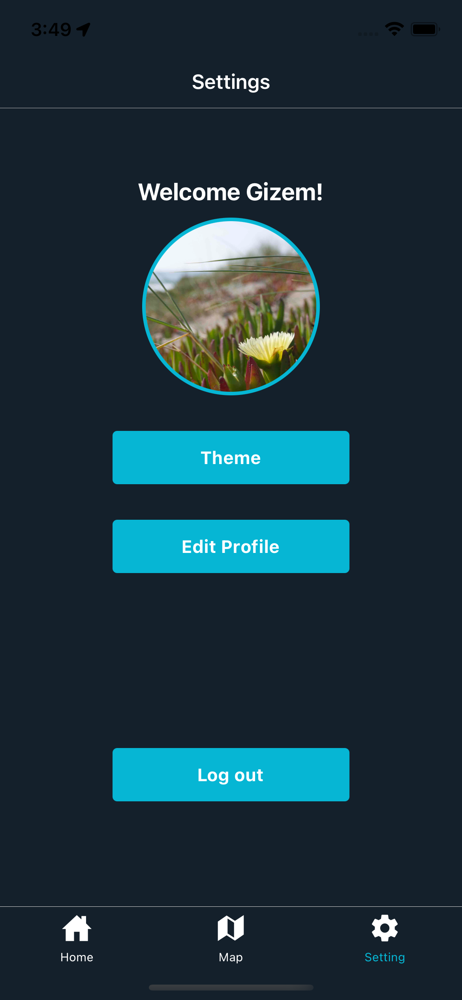</td>
        </tr>
        <tr>
            <td>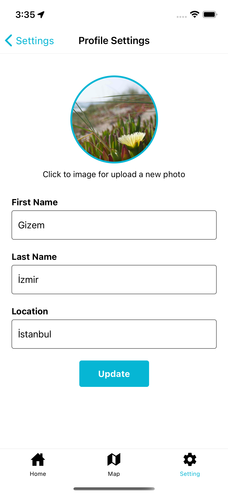</td>
            <td>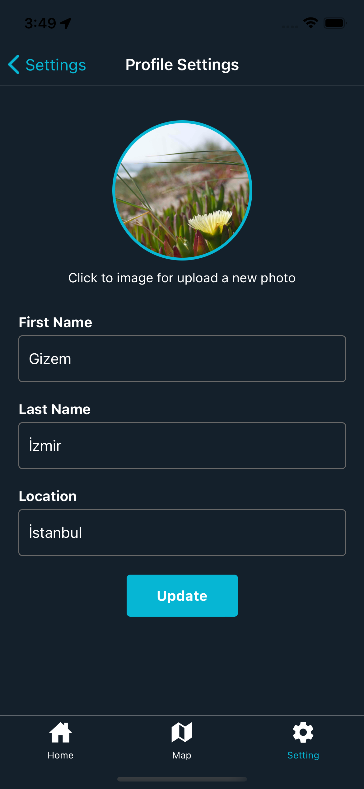</td>
        </tr>
        <tr>
            <td>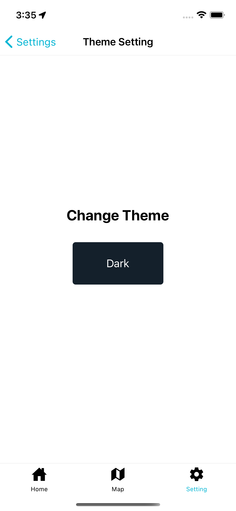</td>
            <td>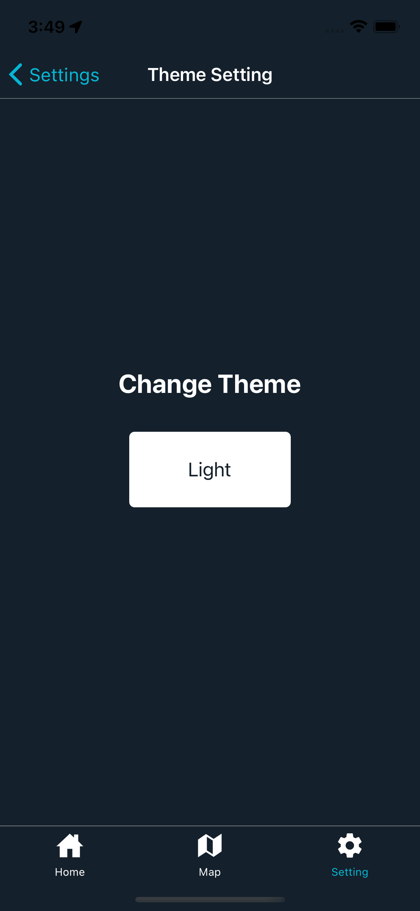</td>
        </tr>
    </tbody>
</table>